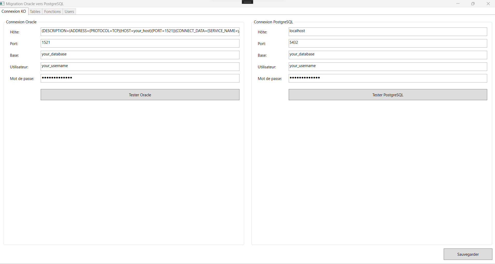

# Oracle-PostgreSQL-Database-Migrator

## Description

This project is a tool to migrate a database from Oracle to PostgreSQL.

## License

This project is licensed under the MIT License - see the [LICENSE.txt](LICENSE.txt) file for details.

This project started in 2024 and is still in development.

This project started as a Winform application but was converted to a WPF application.

